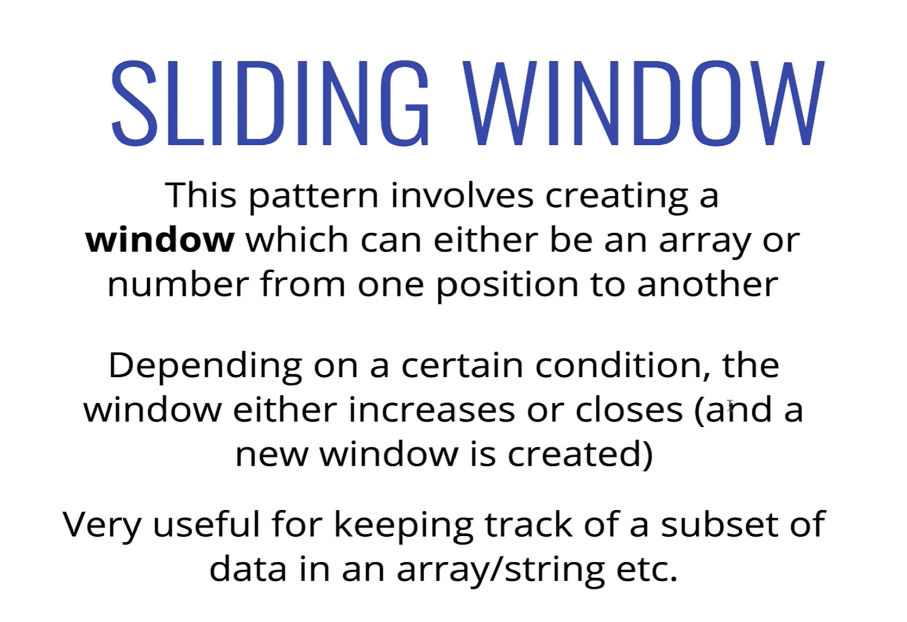
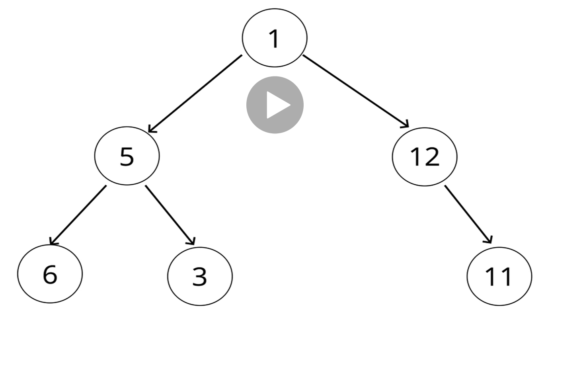
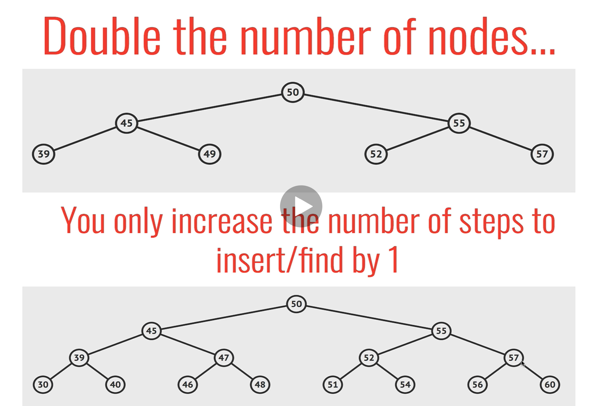
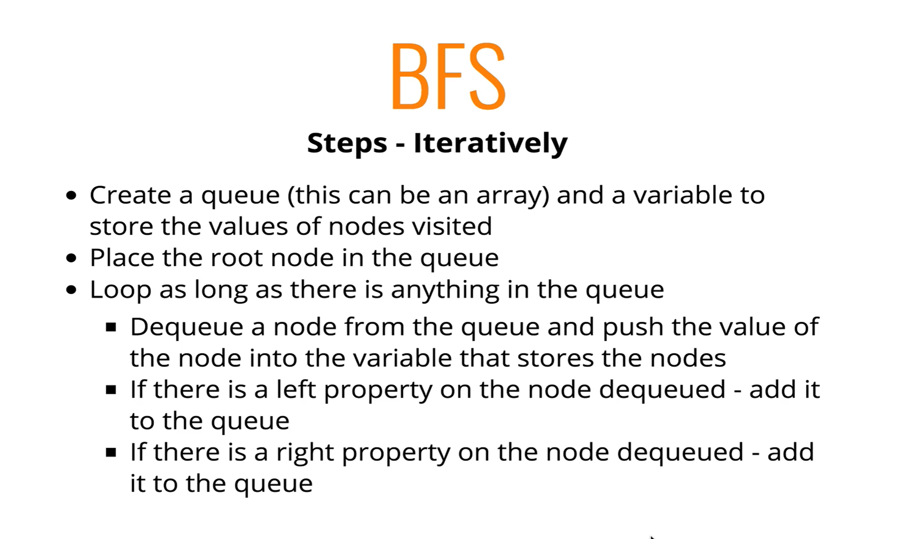

## Big O Notation


## Common Problem Solving Patterns

### Frequency Counters

- Time Complexity O(n)
- This pattern uses objects or sets to collect values/frequencies of values
- This can often avoid the need for nested loops or O(N^2) operations with arrays/strings


- `same([1,2,3], [4,1,9]) //true`
- `same([1,2,3], [1,9]) //false`
- `same([1,2,1], [4,4,1]) //false`


- Sample problem


### Multiple Pointers

- Idea around strategy


- Example problem


```
sum([-4, -3, -2, -1. 0, 1, 2, 5])`
* Start with -4 and 5
    - -4 + 5 > 0
    - -4 + 2 < 0
    - -3 + 2 < 0
    - -2 + 2 = 0 DONE
```

### Sliding Window Pattern

- Idea around strategy



- An example


- Naive solution relies on nested looping
    - Time complexity O(n^2)

- Optimized solution


```
maxSubarraySum([2,6,9,2,1,8,5,6,3], 3)
- Create a sum that is 2 + 6 + 9
- Then subtract (at index 0) and add 2 (add index 3) - is this newSum > initialSum?
- Then subtract 6 and add 1
- Then subtract 9 and add 8
- Then subtract 2 and add 5
- Then subtract 1 and add 6
- Then subtract 8 and add 3
```

### Divide and Conquer

- Idea behind pattern


- Example


- Naive solution just loops over entire array and has O(n) time complexity

- Refactor


```
[1,2,3,5,6,8,9,12,15,16,29]
* Divide array (pick a middle point) - if value we're looking for greater than or less than 8, so you can ignore left hand side
    * Array has now been divided in half
* Pick middle again - is that value greater, less than, or equal? And continue on
```


## Binary Search Trees

### Introduction

- What is a tree?
    - A data structure that consists of nodes in a *parent/child* relationship


- Each node can have 0 to many children
- Lists are `nonlinear`
    - You can have more than one pathway through the tree
    - You can think of a `singly linked list` as a special sort of tree

<br>

- Some rules to being a tree
    - A node can only point to a child
    - Nodes can't point to siblings
    - Node can't point to parents

<br>

- The below aren't tree


**Tree Terminology**

- `Root` - the top node in a tree
- `Child` - A node directly connected to another node when moving away from the root
- `Parent` - Converse notion of a child
- `Siblings` - A group of nodes with the same parent
- `Leaf` - A node with no children
- `Edge` The connection between one node and another

### Uses for Trees

- HTML DOM is a tree
- Network Routing
    - Message transmission is based on tree
    - https://en.wikipedia.org/wiki/Routing
- Abstract Syntax Tree
    - Describing the syntax of a programming language using a tree structure


- Commonly used in AI
    - `Decision tree`
    - Could break down the logic of a board game (like tic tac toe for example) and the AI can make decisions on what to do based on the tree


- Folder structure in OS
- JSON
    - The parsing, for example, traverses the tree and turns it into an object

### Intro to Binary Trees

- We'll be focusing on Binary Trees and Binary Search Trees (BST)
- BST makes searching for data easily

<br>

- A binary tree can at most have 2 children



- Example below is not a Binary Tree


**Binary Search Trees**

- BSTs are sorted in a particular way
- Looking at the parent node (starting with the root)
    - Number less than parent is on left
    - Number more than parent is on right


### Our Tree Classes

- Refer to binary-search-tree/index.js for code
- Steps for creating a new node in a tree

#### Inserting Logic


#### Finding Logic


- Thing to note here, you can cut (usually) the tree in half every time you go left or right when traversing it

#### Big O of BST

- Inserting - `O(log n)`
    - Best and average
- Searching - `O(log n)`
    - Best and average



- If you do an insert for 59 in the top BST of the image above
    - You go from 50 -> 55 -> 57, insert 59
        - 3 steps and then insert
- If you do an insert for 61 in the bottom BST (this has double the number of nodes)
    - You go from 50 -> 55 -> 57 -> 60, insert 61
        - 4 steps and then insert
- `Because of how the BST is sorted, as we double the size of the tree, we only increase the number of steps by 1`


<br>

- In the below case, you'd have to traverse every element if you kept having larger elements on the right
- This is `O(n)`


## Tree Traversal

- How to visit every node 1 time?
- Two different approaches
    - Breadth first search - BFS
    - Depth first search - DFS

**Breadth First Search**


**Depth First Search**

*In Order*


*Pre Order*


*Post Order*


### Breadth First Search (BFS)

- Visit every node on the same level before we move on

**Implementation**



### Depth First Search (DFS)

**PreOrder**

- Value gets added to the list as soon as we add it
- Traverse left and then right


- Steps


**PostOrder**

- We visit a node after we've looked at the left and right
- This is why you see 10 being added last


- Steps


**InOrder**


### When to Use BFS and DFS

- Depends on the tree
- Space used up can be a lot more in BFS for a wide tree
- With DFS, it would use less space for a tree that is wider than it is deep

#### Different DFS types

- `InOrder` gets you sorted data back for a binary search tree
    - You can get set of all nodes in order
- `PreOrder` can be used to `export` a tree structure so that it is easy reconstructed or copied

## Heaps

- A special type of `tree`
- Very similar to a binary search tree
- In a `MaxBinaryHeap`, parent nodes are always larger than child nodes
- In a `MinBinaryHeap`, parent nodes are always smaller than child nodes


**Max Binary Heap**

- Each parent has at most two child nodes
- The value of each parent is always greater than its child nodes
- In a max Binary Heap, the parent is greater than the children, but there are no guarantees between sibling nodes
- A binary heap is as compact as possible
    - All the children of each node are as fullas they can be
    - Left children are filled out first

<br>

- Binary Heaps are used to implement Priority Queues which are very commonly used
- Used with `graph traversal` algorithms

### Storing Heaps


- Finding an elements children


- Finding an elements parent


### Heap: Insert into


- 55 goes to end of array
- This means it is a child of 33
- Now we bubble up
- We take 55 and compare to 33 (it's parent) and we swap them because 55 > 33
- 55 is now a child of 41
- Swap 55 and 41 because 55 > 41

